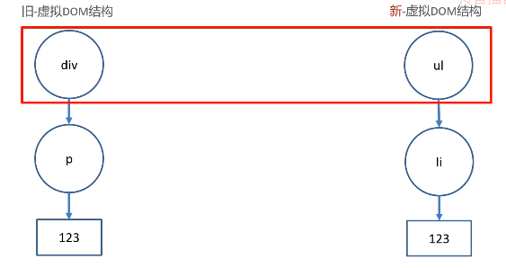
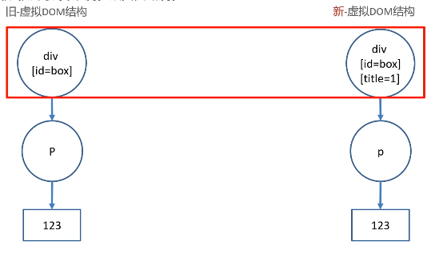
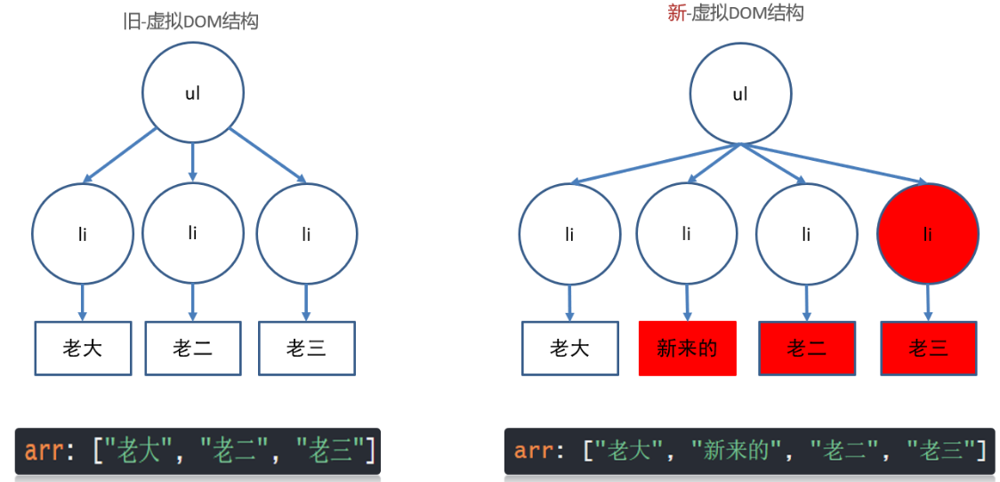
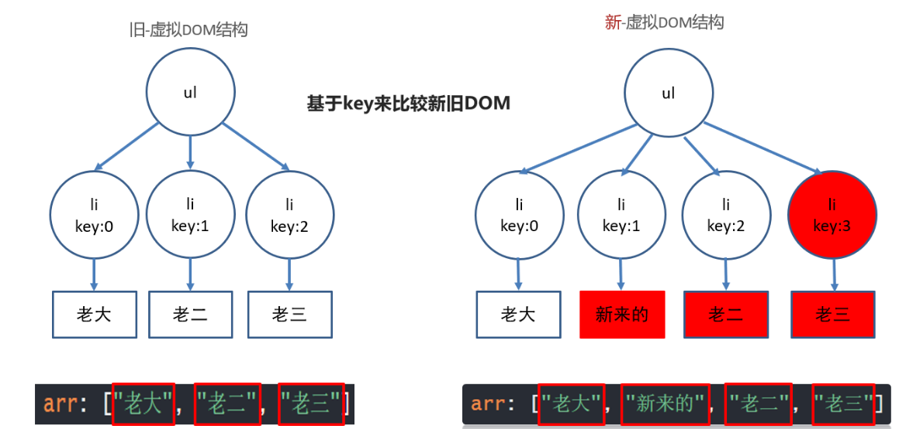
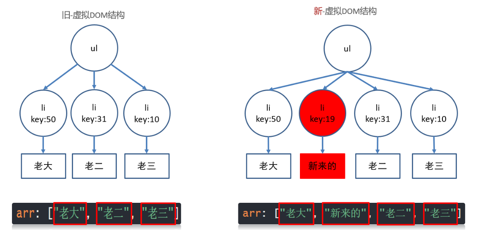

# webpack

基本作用: 将许多零碎的小文件整合到一起, 缩小文件的体积

# webpac配置

## webpack的使用方法

```javascript
// 1. 初始化包环境
npm init
// 2. 安装依赖包
// -D：表示将webpack、webpack-cli这两个包记录在开发环境
npm install webpack webpack-cli -D 
// 3. 运行webpack
webpack
// 注: index.js是webpack打包的入口文件
```

## 修改webpack默认的入口文件与出口文件位置

```javascript
const path = require('path')

module.exports = {
  entry: './src/index.js', // 入口文件位置
  output: {
    path: path.resolve(__dirname, 'dist'), // 出口文件位置
    filename: 'my-first-webpack.bundle.js', // 出口文件名称
  },
};

// 注意: webpack每次打包只会覆盖同位置同名的文件
//      所以每次打包前尽量将上一次打包的文件夹删除
```

## webpack打包流程

npm run build(自定义命令) ===> 执行webpack命令 ===> 检查是否有配置文件

有: 根据配置文件得到配置参数 ===> 

无: 执行默认配置文件 ===>

同: 找到入口 ===> 先构建依赖关系图编译各个模块文件 ===> 输出 ===> 指定文件

## webpack打包后生成html文件并自动引入打包后的js

```javascript
// 1. 下载 html-webpack-plugin插件
const HtmlWebpackPlugin = require('html-webpack-plugin')

module.exports = {
    plugins: [
    new HtmlWebpackPlugin({
      template: './public/index.html'  // 告诉webpack使用插件时, 以我们自己的html文件作为模板去生成dist/html文件
    })
  ]
}
```

## 加载器 - 处理css文件

```javascript
//  下载 style-loader css-loader 依赖包
module.exports = {
    module: { // 加载器配置
    rules: [ // 规则
      { // 一个具体的规则对象
        test: /\.css$/i, // 匹配.css结尾的文件
        use: ["style-loader", "css-loader"], // 让webpack使用这2个loader处理css文件
        // 执行顺序是从右到左的, 所以不能颠倒顺序
        // css-loader: webpack解析css文件-把css代码一起打包进js中
        // style-loader: css代码插入到DOM上 (style标签)
      },
    ],
  },
}
```

## 加载器 -  处理less文件

```javascript
// 下载 less less-loader 依赖包

module.exports = {
    module: { // 加载器配置
    rules: [ // 规则
      {
        test: /\.less/,
        use: ['style-loader', 'css-loader', 'less-loader']
      }
    ],
  },
}
```

## 加载器 - 处理图片文件

### webpack4 及之前版本

```javascript
// 下载 url-loader file-loader依赖
// url-loader文档：它把文件转换成base64 uri
// file-loader文档：将文件上的import/require()解析为一个url，并将该文件发送到输出目录。
```

### webpack4 之后版本

```javascript
// 不再需要下载依赖

module.exports = {
    module: { // 加载器配置
    rules: [ // 规则
      { // 图片文件的配置(仅适用于webpack5版本)
        test: /\.(gif|png|jpg|jpeg)/,
        type: 'asset' // 匹配上面的文件后, webpack会把他们当做静态资源处理打包
          // 如果你设置的是asset模式
          // 以8KB大小区分图片文件
          // 小于8KB的, 把图片文件转base64, 打包进js中
          // 大于8KB的, 直接把图片文件输出到dist下
      }
    ],
  },
}
```

## webpack加载图片文件的优缺点🔥

>优: 浏览器不用发请求了，可以直接读取
>
>缺: 如果图片太大，再转base64就会让图片的体积增大 30% 左右

## 加载器 - 处理字体图标

```javascript
// webpack5

module.exports = {
    module: { // 加载器配置
    rules: [ // 规则
            { // webpack5默认内部不认识这些文件, 所以当做静态资源直接输出即可
            test: /\.(eot|svg|ttf|woff|woff2)$/,
            type: 'asset/resource', // 所有的字体图标文件, 都输出到dist下
            generator: { // 生成文件名字 - 定义规则
              filename: 'fonts/[name].[hash:6][ext]' // [ext]会替换成.eot/.woff
            }
          }
        ]
    }
}
```

## 加载器 - 处理高版本js语法🔥	

>**面试问题： 你对前端浏览器兼容性上有过那些处理方案？**
>
>通过webpack的js降级设置，来让高版本的js语法降级为低版本，适用于ie低版本浏览器；ie已经停止维护了，所以慢慢的我们不会去关注ie的适配问题

```javascript
// 下载 babel-loader @babel/core @babel/preset-env 依赖

module.exports = {
    module: { // 加载器配置
    rules: [ // 规则
     {
        test: /\.m?js$/,
        exclude: /(node_modules|bower_components)/, // 不去匹配这些文件夹下的文件（防止影响其他第三方依赖包）
        use: {
          loader: 'babel-loader', // 使用这个loader处理js文件
          options: { // 加载器选项
            presets: ['@babel/preset-env'] // 预设: @babel/preset-env 降级规则-按照这里的规则降级我们															   的js语法
          }
        }
      }
    ],
  },
}
```

# webpac开发服务器(热更新)

```javascript
//	下载 webpack-dev-server 依赖

"scripts": {
    "build": "webpack --mode production", // 生产环境
    "serve": "webpack serve --mode development" // 开发环境
  },
```

## webpack-dev-server配置(自定义端口号)

```javascript
module.exports = {
    devServer: {
        port: 3000 // 端口号
    }
}
```

# VUE的特点

>vue最大的特点是渐进式框架
>
>渐进式: 逐渐使用, 集成更多的功能

# VUE安装

```javascript
// 1. 全局安装
npm i @vue/cli -g
// 2. 查看版本号
vue -V
// 3. 创建项目
vue create 项目文件夹名称 // 注:项目文件夹名称一般由 小写字母+短横线 组成
// 4. 选择模板 vue2
// 5. 运行
npm run serve
```

# Vue配置

## 端口号

```javascript
const { defineConfig } = require('@vue/cli-service')
module.exports = defineConfig({
  devServer: { // 自定义服务配置
    open: true,  // 当开启服务器时自动打开浏览器
    port: 3000 // 自定义端口号
    host: 'localhost' // 解决vue域名为0.0.0.0
  }
})
```

## 规范代码检测

>环境: 在定义了变量, 没有使用的情况下

```javascript
// 方法一 (全局屏蔽eslint检测)
给配置文件添加 lintOnSave:false 属性
// 方法二 (局部屏蔽eslint检测 - 单行注释)

// eslint-disable-next-line
let a = 'a'

or

let a = 'a'	// eslint-disable-next-line

// 方法三 (局部屏蔽eslint检测 - 多行注释)
/* eslint-disable */
let a = 123
/* eslint-enable  */
```

## style配合scoped属性, 保证样式只针对当前template内标签生效

# 插值表达式

>可以利用双大括号直接在dom标签中插入内容，不必进行webapi的一系列操作

**语法:** {{ 表达式 }}

```vue
<template>
  <div>
    <div>{{ msg }}</div>
    <div>{{ 1 == 1 }}</div>
    <div>{{ 1 + 1 }}</div>
    <div>
      我的名字是{{ obj.name }},我今年{{ obj.age }}岁,
      {{ obj.age >= 18 ? "我成年了" : "我没有成年" }}.
    </div>
  </div>
</template>

<script>
export default {
  name: "expressionDemo",
  data() {
    return {
      msg: "插值表达式",
      obj: {
        name: "法外狂徒",
        age: 18,
      },
    };
  },
};
</script>

<style>
</style>
```

# MVVM模式🔥

vue使用的mvvm设计模式。**MVVM**是`Model-View-ViewModel`缩写，也就是把`MVC`中的`Controller`演变成`ViewModel`。`Model`层代表数据模型，`View`代表UI组件，`ViewModel`是`View`和`Model`层的桥梁，数据会绑定到`viewModel`层并自动将数据渲染到页面中，视图变化的时候会通知`viewModel`层更新数据。

# v-bind 动态属性

>给标签属性设置vue变量的值

**语法:**

1.  v-bind:属性名="vue变量"
2.  :属性名="vue变量"

**注意:** 当动态属性是图片或其他文件路径时, 那么不可以直接将路径的字符串作为动态属性变量的值, 需要使用import或者是require来进行引入

**案例:**

```vue
<template>
  <div>
    <a v-bind:href="url">百度</a>
    <a :href="url">百度</a>
    <!-- 
      关于动态属性的特例： 在使用动态属性渲染图片时，不可以直接将变量的值设置为路径
      原因： v-bind会把这个路径认为是字符串
      解决方案： 
        1. 通过 import 的方式引入图片并且赋值给data中的变量
        2. 通过 require 的方式引入图片并赋值给data中的变量

      以上两种解决方案，你觉得哪一个更好呢？？
      答： require 的引入方式更为友好。 当一个vue文件被使用时，那么既然是js代码，那么遵循从上往下依次执行，import中引入的图片就会在页面渲染初期被加载，而require引入的图片，只有在使用的时候才会被加载，初次开启页面会显得更加的高效
    -->
    <hr />
    
    
    <hr>
    
    <hr>
    
  </div>
</template>

<script>
import image from '../assets/123.png'
export default {
  name: "bindDemo",
  data() {
    return {
      url:'http://baidu.com',
      url2:'../assets/123.png',
      url3:image,
      url4:require('../assets/123.png')
    };
  },
};
</script>

<style>
</style>
```

# vue项目优化🔥

可以用require的方式引入图片，当使用到它的时候才会按需加载，而不会像import引入那样在页面创建时就会加载，加快页面初次加载效率

# v-on 事件绑定

>给标签绑定事件

**语法:**

1.  v-on:事件名=回调函数
2. @事件名=回调函数

**案例:**

```vue
<template>
  <div>
    <div>当前数量:{{count}}</div>
    <button v-on:click='count+=1'>点击+1</button>
    <button v-on:click='addFn'>点击+2</button>
    <button v-on:click='addCountFn(5)'>点击+5</button>
    <button @click="reduceFn()">点击-1</button>
  </div>
</template>

<script>
export default {
  name:'eventBindDemo',
  data(){
    return{
      count:0
    }
  },
  methods:{
    // 这里的this代表的是 export default 这个对象
    addFn(){
      this.count+=2
    },
    addCountFn(num){
      this.count+=num
    },
    reduceFn(){
      this.count--
    }
  }
}
</script>

<style>

</style>
```

# v-on 获取事件对象

**方法:**

1. 无传参, 通过形参直接接收
2. 传参, 通过`$event`指代事件对象传给事件处理函数

**案例:**

```vue
<template>
  <div>
    <!-- 事件对象 -->
    <!--  
    v-on获取事件对象 - event 1. 无参数获取事件对象 -
    我们的时间对象event默认在第一个形式参数上 2.
    有参数(特指带小括号的方法)，这个小括号会覆盖event默认参数，我们可以同$event的实际参数来代替这个事件对象
    注意事项：一般情况下，我们都将事件对象event 放到整个形式参数的最后一位
     -->
    <button @click="eventFn">事件一</button>
    <button @click="eventFn2(5, $event)">事件二</button>
    <a @click="go" href="http://www.baidu.com">我想去看诗和远方</a>
  </div>
</template>

<script>
export default {
  name: "eventBindDemo",
  methods: {
    eventFn(e) {
      console.log(e);
    },
    eventFn2(num, e) {
      console.log(num, e);
    },
    go(e){
      e.preventDefault()
    }
  },
};
</script>

<style>
</style>
```

# v-on修饰符

**语法:** @事件名.修饰符=回调函数

- .stop 阻止事件冒泡
- .prevent 阻止默认行为
- .once 程序运行期间, 只触发一次事件处理函数

**案例:**

```vue
<template>
  <div @click='fatherFn'>
    <p @click.stop='stopFn'>点击后希望阻止冒泡</p>
    <a href="http://www.baidu.com" @click.prevent.stop>跳转百度</a>
    <p @click.once="clickCount">观察这个点击事件到底执行几次</p>
  </div>
</template>

<script>
export default {
  name:'modifierDemo',
  data(){
    return{

    }
  },
  methods:{
    // 父标签
    fatherFn(){
      console.log('冒泡事件触发了')
    },
    // 阻止冒泡
    stopFn(){
      console.log('子元素事件触发')
    },
    // 执行次数
    clickCount(){
      console.log('once触发')
    }
  }
}
</script>

<style>

</style>
```

**v-on按键修饰符**

**语法:** @事件类型.按键=回调函数       // **按键必须为全小写**

**案例:**

```vue
<template>
  <input type="text" name="" id="" @keyup.enter="keyupFn">
</template>

<script>
export default {
  name:'keyDecoration',
  methods:{
    keyupFn(e){
      console.log('事件对象',e)
    }
  }
}
</script>

<style>

</style>
```

# v-model双向绑定

>把value属性和vue数据变量, 双向绑定到一起, 当其中一个值发生改变, 另一个的值也跟着改变.

**语法:** v-mode='vue数据变量'

**案例:**

```vue
<template>
  <div>
    <!-- 文本框     -->
    <div>
      <label for="uname">用户名</label>
      <input type="text" name="uname" v-model="uname" />
    </div>
    <!-- 下拉列表框 -->
    <div>
      <label for="">地区:</label>
      <select v-model="area" id="">
        <option value="" selected>--请选择地区--</option>
        <option value="成都">成都</option>
        <option value="成都">北京</option>
        <option value="成都">上海</option>
      </select>
    </div>
    <!-- 单选框 -->
    <div>
      <label for="">性别:</label>
      <input type="radio" value="男" v-model="sex">男
      <input type="radio" value="女" v-model="sex">女
    </div>
    <!-- 复选框 -->
    <div>
      <label for="">爱好</label>
      <input type="checkbox" value="吃饭" v-model="hobby">吃饭
      <input type="checkbox" value="睡觉" v-model="hobby">睡觉
      <input type="checkbox" value="打豆豆" v-model="hobby">打豆豆
    </div>
    <!-- 文本域 -->
    <div>
      <textarea v-model="text" id="" cols="30" rows="10"></textarea>
    </div>
  </div>
</template>

<script>
export default {
  name: "dataBind",
  data() {
    return {
      uname: "",
      area: "",
      sex:'',
      hobby:[],
      text:""
    };
  },
};
</script>

<style>
</style>
```

# vue双向绑定的原理🔥

>当一个Vue实例创建时，Vue会遍历data选项的属性，用`Object.defineProperty`将它们转化为`getter/setter`并且在内部追踪相关依赖，在属性被访问拒绝和修改时通知变化。每个组件实例都有相应的watcher程序实例，它会在组件渲染的过程中把属性记录为依赖，之后当依赖项的setter被调用时，会通知watcher重新计算，从而致使它关联的组件得以更新。

# v-model修饰符

**语法:** v-model.修饰符="vue数据变量"

-  number  以parseFloat转成数字类型（会自动清除非数字及以后部分\
- trim 去除首尾空白字符
- lazy 在change时触发而非input时（一切可以触发change事件的情况，如失焦）

**案例:**

```vue
<template>
  <div>
    <label for="">手机号:</label>
    <input type="text" v-model.trim.number.lazy="phone">
  </div>
</template>

<script>
export default {
  name:'bindDecription',
  data(){
    return{
      phone:''
    }
  }
}
</script>

<style>

</style>
```

# v-text与v-html

>更新DOM对象的innerText/innerHTML

**语法:** 

- v-text="vue数据变量"
- v-html="vue数据变量"

**案例:**

```vue
<template>
  <div>
    <div v-text="str"></div>
    <div v-html="str"></div>
  </div>
</template>

<script>
export default {
  name:'insertDemo',
  data(){
    return{
      str:'<span style="color:skyblue">我是一段文本</span>'
    }
  }
}
</script>

<style>

</style>
```

# v-if与v-show

>同: 标签的显示与隐藏
>
>异: v-show是给dom元素添加一个display:none属性,该元素还在dom树上,一般应用于切换比较频繁的地方
>
>​	  v-if是将该dom元素从dom树上彻底删除,                                                      

**语法:**

- v-show="vue变量"
- v-if="vue变量"

**案例:**

```vue
<template>
  <div>
    <p v-show="false">我是v-show</p>
    <p v-if="false">我是v-if</p>
    <div>
      您是:?
      <p v-if="age < 18">未成年</p>
      <p v-else-if="age >= 18 && age < 22">大学生</p>
      <p v-else>社畜</p>
    </div>
  </div>
</template>

<script>
export default {
  name: "isShow",
  data() {
    return {
      age: 17,
    };
  },
};
</script>

<style>
</style> 
```

# v-for

>渲染数据列表

**语法:**

- v-for="值 in 目标结构"
- v-for="(值,索引) in 目标结构"

**目标结构:**

- 数组
- 对象
- 数字
- 字符串

**案例:**

```vue
<template>
  <div>
    <!-- 遍历数组 -->
    <ul>
      <li v-for="(value, index) in arr" :key="index">{{ value }}</li>
    </ul>
    <!-- 遍历对象 -->
    <ul>
      <li v-for="(value, key) in obj" :key="key">{{ value }}---{{ key }}</li>
    </ul>
    <!-- 遍历数组对象 -->
    <ul>
      <li v-for="value in arr2" :key="value.id">
        {{ value.id }}---{{ value.name }}
      </li>
    </ul>
    <!-- 遍历数字 -->
    <ul>
      <li v-for="(value, index) in num" :key="index">
        {{ value }}---{{ index }}
      </li>
    </ul>
    <!-- 遍历字符串 -->
    <ul>
      <li v-for="(value, index) in str" :Key="index">
        {{ value }}---{{ index }}
      </li>
    </ul>
  </div>
</template>

<script>
export default {
  name: "v-for",
  data() {
    return {
      arr: [1, 2, 3],
      arr2: [
        { id: 1, name: "一号" },
        {
          id: 2,
          name: "二号",
        },
        {
          id: 3,
          name: "三号",
        },
      ],
      obj: {
        name: "张三",
        age: 18,
        work: "法外狂徒",
      },
      num: 12,
      str: "hello world",
    };
  },
};
</script>

<style>
</style>
```

# v-for与v-if组合使用

当 v-if 与 v-for 一起使用时，v-for 具有比 v-if 更高的优先级。这意味着 v-if 将分别重复运行于 每个 v-for 循环中，即先运行 v-for 的循环，然后在每一个 v-for 的循环中，再进行 v-if 的条件对比，会造成性能问题，影响速度

**解决方法：在v-for前对数组进行筛选**

**案例:**

```vue
<template>
  <div>
    <ul>
      <li v-for="(value,index) in arr.filter(item=>item.name!=='二号')" :key="index">{{value}}</li>
    </ul>
  </div>
</template>

<script>
export default {
  name:'togetherDemo',
  data(){
    return{
      arr: [
        { id: 1, name: "一号" },
        {
          id: 2,
          name: "二号",
        },
        {
          id: 3,
          name: "三号",
        },
      ],
    }
  }
}
</script>

<style>

</style>
```

# v-for更新监测

>原因: 当v-for遍历的目标结构改变, `Vue`触发v-for的更新

**案例:**

```vue
<template>
  <div>
    <ul>
      <li v-for="(item,index) in arr" :key="index">{{item}}</li>
    </ul>
    <button @click="reverseArr">颠倒数组</button>
    <button @click="sliceArr">数组截取</button>
    <button @click="updateArr">更新数组第一个元素</button>
  </div>
</template>

<script>
export default {
  name: 'updateDemo',
  data() {
    return {
      arr: [1, 2, 3, 4, 5, 6, 7]
    }
  },
  methods: {
    reverseArr() {
      this.arr.reverse()
    },
    sliceArr() {
      this.arr.splice(3)
    },
    updateArr() {
      // this.arr[0] = 999 // 为什么显示值修改了 页面没更新???
      // 应急方案: $.set()强制更新
      /* 
        this.$set(参数1， 参数2， 参数3)
        参数1： 更新的目标结构 - v-for所遍历的数据
        参数2： 更新数据的位置 - 常常是索引位置
        参数3： 需要更新的值
      */
      // 方案二
      this.arr.splice(0, 1, 999)
    }
  }
}
</script>

<style>

</style>
```

# v-for重要规则🔥

数组对象中，有id就用id，没有id则用索引。如果用id页面报错，则换成索引。

# js数组方法复习

## 不会改变原数组

- map 给数组内的所有元素都执行一次回调函数
- filter 数组过滤
- forEach 数组遍历
- render 累加
- som 数组内只要有一个元素通过回调函数的测试, 就返回true
- every 数组内的所有元素都通过回调函数的测试, 就返回true
- slice 数组截取
- concat 拼接数组
- find 返回满足条件的第一个数组元素
- findIndex 返回满足条件的第一个数组元素的索引

## 会改变原数组

- push 在数组末尾追加一个元素
- pop 删除数组末尾一个元素
- unshift 在数组首位追加一个元素
- shift 删除数组首位元素
- splice 根据参数的不同,可以实现增 删 改功能 (参数一:开始索引,参数二:几个元素,参数三:替换的元素)
- sort 数组排序
- reverse 翻转数组
- flat 扁平化数组 转一维(flat(Infinity))

#  虚拟dom🔥

>  概念：.vue文件中的template里写的标签, 都是模板(并不是浏览器中看到的真实的dom元素), 都要被vue处理成虚拟DOM**对象**, 才会渲染显示到真实DOM页面上

1. 内存中生成一样的虚拟DOM结构 (==本质是个JS对象==)

    因为真实的DOM属性过多, 没办法快速的知道哪个属性改变了

    比如template里标签结构

    ```vue
    <template>
        <div id="box">
            <p class="my_p">1234</p>
        </div>
    </template>
    ```

    对应的虚拟DOM结构

    ```js
    const dom = {
        type: 'div',
        attributes: [{id: 'box'}],
        children: {
            type: 'p',
            attributes: [{class: 'my_p'}],
            text: '1234'
        }
    }
    ```

2. vue数据更新

    * 生成新的虚拟DOM结构
    * 和旧的虚拟DOM结构对比
    * 利用diff算法, 找不不同, 只更新变化的部分(重绘/回流)到页面

**虚拟DOM优势：**虚拟DOM保存在内存中, 只记录dom关键信息, 配合different算法提高DOM更新的性能

# **你对虚拟DOM的理解？**🔥

**答：**`虚拟DOM`本质上是`JavaScript`对象，是对`真实DOM`的抽象表现。状态变更时，记录新树和旧树的差异，最后把差异更新到真正的`dom`中**render函数**

1. 根据`tagName`生成父标签，读取props，设置属性， `如果有content内容`，设置`innerHtml或innerText`；
2. 如果存在子元素，遍历子元素递归调用render方法，将生成的子元素依次添加到父元素中，并返回根目录；

你对虚拟DOM的理解？**

**答：**`虚拟DOM`本质上是`JavaScript`对象，是对`真实DOM`的抽象表现。状态变更时，记录新树和旧树的差异，最后把差异更新到真正的`dom`中**render函数**

1. 根据`tagName`生成父标签，读取props，设置属性， `如果有content内容`，设置`innerHtml或innerText`；
2. 如果存在子元素，遍历子元素递归调用render方法，将生成的子元素依次添加到父元素中，并返回根目录；


# diff算法 - 同级比较🔥

找不同

> vue用diff算法, 新虚拟dom, 和旧的虚拟dom比较

## 场景1: 根元素变了 =》 删除重建 

旧虚拟DOM

```vue
<div id="box">
    <p class="my_p">123</p>
</div>
```

新虚拟DOM

```vue
<ul id="box">
    <li class="my_p">123</li>
</ul>
```



## 场景2: 根元素没变, 属性改变 =》 元素复用, 只更新属性

旧虚拟DOM

```vue
<div id="box">
    <p class="my_p">123</p>
</div>
```

新虚拟DOM

```vue
<div id="myBox" title="标题">
    <p class="my_p">123</p>
</div>
```



**问题：**

1. diff算法如何比较新旧虚拟DOM?
2. 根元素变化?
3. 根元素未变, 属性改变?

> 思考： 如果标签内子标签/内容改变，diff的算法是如何对应改变的？

# diff算法 - 属性key🔥

**场景3：根元素没变, 子元素没变, 元素内容改变**

## 没有key =》 就地更新

​		v-for不会移动DOM, 而是尝试复用, 就地更新，如果需要v-for移动DOM, 你需要用特殊 attribute `key` 来提供一个排序提示

```vue
<template>
  <div>
    <ul>
      <li v-for="obj in arr">
        {{ obj.name }}
        <input type="text">
      </li>
    </ul>
    <button @click="btn">下标1位置插入新来的</button>
  </div>
</template>

<script>
export default {
  data() {
    return {
      arr: [
        {name: '老大',id: 50},
        {name: '老二',id: 31},
        {name: '老三',id: 10}
      ],
    };
  },
  methods: {
    btn(){
      this.arr.splice(1, 0, {
        id: 19, 
        name: '新来的'
      })
    }
  }
};
</script>
```


旧 - 虚拟DOM结构  和  新 - 虚拟DOM结构 对比过程



## 有key - 值为索引 => 就地更新

​		因为新旧虚拟DOM对比, key存在就复用此标签更新内容, 如果不存在就直接建立一个新的

key为索引-图解过程 (又就地往后更新了)



1. v-for先循环产生新的DOM结构, key是连续的, 和数据对应

2. 然后比较新旧DOM结构, 找到区别, 打补丁到页面上

    最后补一个li, 然后从第二个往后, 都要更新内容

## 有key - 值为id(不重复的值) => 移动更新

> <font color='red'>key的值只能是唯一不重复的, 字符串或数值</font>

v-for不会移动DOM, 而是尝试复用, 就地更新，如果需要v-for移动DOM, 你需要用特殊 attribute(属性) `key` 来提供一个排序提示

新DOM里数据的key存在, 去旧的虚拟DOM结构里找到key标记的标签, **复用标签**

新DOM里数据的key存在, 去旧的虚拟DOM结构里没有找到key标签的标签, **创建/插入**

旧DOM结构的key, 在新的DOM结构里没有了, 则 **移除key所在的标签**


```vue
<template>
  <div>
    <ul>
      <li v-for="obj in arr" :key="obj.id">
        {{ obj.name }}
        <input type="text">
      </li>
    </ul>
    <button @click="btn">下标1位置插入新来的</button>
  </div>
</template>
```



> 总结: 不用key也不影响功能(就地更新), 添加key可以提高更新的性能

问题：在实际开发过程中，每次通过v-for进行数据的遍历都得用id吗？

>  答： 数组对象中，有id就用id，没有id则用索引。如果用id页面报错，则换成索引。

# 面试背点02：- 准备找工作前一周拿出来看看理解理解🔥

**问：如何理解Vue中的diff算法？**

**答：**

​		> 找不同！

​		在js中，渲染真是`DOM`的开销是非常大的，比如我们修改了某个数据，如果直接渲染到真实`DOM` ,会引起整个`DOM`树重绘和重排。那么有没有可能实现只更新我们修改的那一小块`DOM`二不要更新整个`DOM`呢?此时我们就需要先根据真实`DOM`生成虚拟`DOM`，当虚拟`DOM`某个节点的数据改变后会生成有一个新的`VNode`，然后新的`VNode`和旧的`VNode`作比较，发现有不一样的地方就直接修改在真实DOM上，然后旧的`VNode`的值为新的`VNode`；

​		**diff**的过程就是调用`patch`函数，比较新旧节点，一边比较一边给真实的`DOM`打补丁，在采用`diff`算法比较新旧节点的时候，比较自会在同层级进行。


**问：什么是patch函数**

**答：**

​		在`patch`方法中，首先进行树级别的比较`new Vnode`不存在就删除`old VNode`，`old VNode`不存在就增加新的`VNode`都存在就执行`diff`更新，当确定需要执行`diff`算法时，比较两个`VNode`，包括三种类型操作：属性更新，文本更新，子节点更新，新老节点均有子节点，则对子节点进行`diff`操作，调用`updatechidren`如果老节点没有子节点，先清空老节点的文本内容，然后为其新增子节点，如果新节点没有子节点，而老节点有子节点的时候，则移除该节点的所有子节点，老节点都没有子节点的时候，进行文本的替换。
